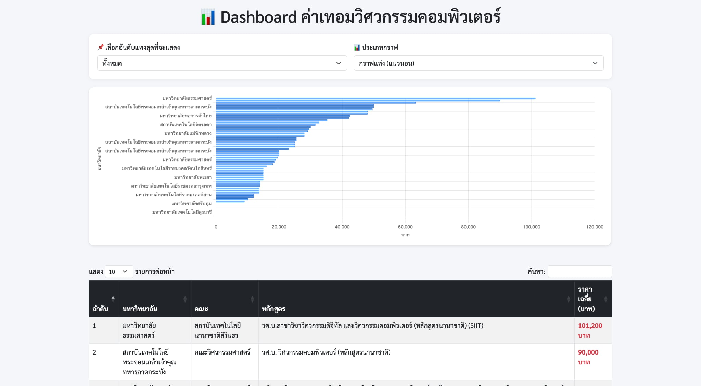
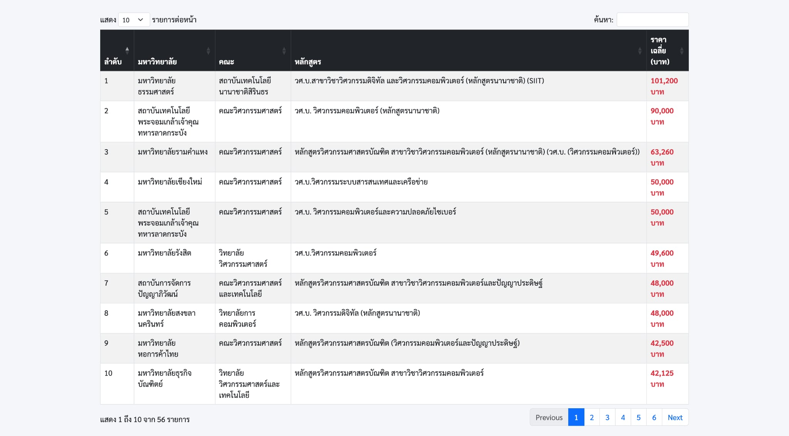

# TCAS Dashboard (Flask + Pandas + Typhoon AI)

เว็บแอปสำหรับวิเคราะห์และแสดง **ค่าใช้จ่ายต่อภาคการศึกษา** ของหลักสูตรวิศวกรรมคอมพิวเตอร์จากมหาวิทยาลัยทั่วไทย  
ข้อมูลมาจาก [MyTCAS API](https://mytcas.com) วิเคราะห์ข้อความภาษาไทยด้วย LLM (Typhoon) และแสดงผลผ่าน Dashboard สวย ๆ ด้วย Flask

---

## ตัวอย่างหน้าจอ Dashboard

> แสดงข้อมูลแบบกราฟและตาราง พร้อมจัดอันดับตามค่าใช้จ่าย




!(templates/template2.jpeg)

---

## ใน repo นี้จะมีการลองกรองข้อมูลทั้ง 2 แบบ ทั้งแบบ regex และ llm แต่แบบที่ใช้นำไปแสดง dashboard คือ จาก llm 
## โครงสร้างไฟล์

| ไฟล์ / โฟลเดอร์ | หน้าที่ |
|------------------|----------|
| `app.py` | Flask app สำหรับแสดง Dashboard |
| `scraping_typhoon.py` | ดึงข้อมูลจาก API + วิเคราะห์ข้อความด้วย Typhoon |
| `scrap_regex.ipynb` | วิเคราะห์ข้อความด้วย regex-only |
| `courses_data.csv` / `.xlsx` | Raw data หลัง scrape |
| `cs_engineering_costs.csv` | ข้อมูลที่ใช้แสดงบน Dashboard |
| `templates/` | HTML template (`dashboard.html`) |
| `v2/` |  **โฟลเดอร์สำหรับทดลองกรองสาขาอื่น ๆ ในวิศวกรรม** (เช่น วิศวกรรมไฟฟ้า, โยธา ฯลฯ) ด้วย Typhoon โดยใช้ logic เดียวกับหลักสูตรคอมพิวเตอร์ |
| `.env` | เก็บ `TYPHOON_API_KEY` (ไม่ควร push) |
| `.env.example` | ตัวอย่างไฟล์ `.env` สำหรับตั้งค่า |
| `.gitignore` | ไฟล์ที่ต้อง ignore เช่น `.env` |
| `requirements.txt` | รายการ dependencies |
| `README.md` | คู่มือการใช้งานโปรเจกต์นี้ |

---

## การติดตั้งและใช้งาน

```bash
git clone https://github.com/xooooiz7/TCAS_dashboard.git
cd TCAS_dashboard

python3 -m venv .venv
source .venv/bin/activate

pip install -r requirements.txt

cp .env.example .env
# แล้วใส่ API Key ของคุณ:
# TYPHOON_API_KEY=YOUR_TYPHOON_API_KEY

# ทดสอบดึงข้อมูลเบื้องต้นด้วย Regex-only
jupyter notebook scrap_regex.ipynb

# หรือวิเคราะห์ด้วย Typhoon AI
python scraping_typhoon.py

# จากนั้นเปิด dashboard
python app.py
# เปิดใน browser: http://127.0.0.1:5000
